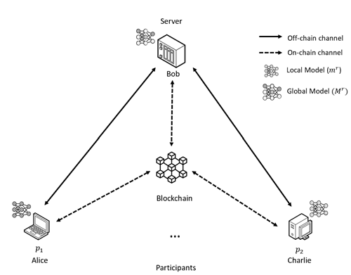

#  Post-quantum and blockchain-based Federated Learning protocol (PQBFL)
 PQBFL is a quantum-secure blockchain-based protocol for Federated Learning. It guarantees post-quantum confidentiality and also a "harvest-now-decrypt-later" attack for the transfer models in a federated learning system. Blockchain is used as an exchange facilitator and tracking structure for the transmitted models.  



<figcaption>PQBFL system model</figcaption>

## Prerequisites

**1. Download  Ganache** https://trufflesuite.com/ganache/

<!--
**2. you have to install IPFS CLI (kubo) from here:** https://docs.ipfs.tech/how-to/kubo-basic-cli/#install-kubo

**2. Enable "Libp2pStreamMounting" in IPFS:**
In CLI:
```
ipfs config --json Experimental.Libp2pStreamMounting true
```
-->


**2. Install Packages:**

you should install required packages

```
pip install -r requirements.txt
```

then You have to compile c files

```
git clone https://github.com/kpdemetriou/pqcrypto.git

cd pqcrypto

sudo python3 compile.py
```


## Run infrastructure
<!--
**1. Run IPFS cli:**

```
ipfs daemon
```
-->
**1. Run Blockchain:** 

Double click ganache emulation to provide us 10 accounts with 100 ETH

**2. Compile and Deploy**

you must compile and deploy the solidity contract on Ethereum blockchain (gnanache) using ETH address and corresponding Private key

```
cd contract

./compile-deploy.py {ETH address} {Private key}
```

## Usage:

There are two modes of operation in PQBFL that can be used in the following ways:

**client mode:**

```
main.py [-h] [-m client] [-c CONTRACT_ADDRESS] [-ek ETH_PRIVATE_KEY] [-e NUM_EPOCHS]

#Example: python main.py -m client -ek 0x8066640e13243b835a97322b56a47a85d352f3b3c1a5e88b72136e38fa8ab0cf -c 0x20dd4Db03EfE8B7585bD8b41f3BD4C6e43399E4D -e 8
```

**server mode:**
```
main.py [-h] [-m server] [-c CONTRACT_ADDRESS] [-ek ETH_PRIVATE_KEY] [-e NUM_EPOCHS] [-id TASK_ID] [-r Round] [-p participants count]

#Example: python main.py -m server -ek 0xa640db19ba46309d661d7434203293271a6bf8ce6b446462395dbfe4f6a70db8 -c 0x20dd4Db03EfE8B7585bD8b41f3BD4C6e43399E4D -id 22 -r 10 -p 3
```

## Note
Currently, the existing implementation does not support previously released tasks and only checks the last block for the current task. This means that if the server first publishes the task while the clients are not listening to receive the task, these clients cannot receive the previously published task. Therefore, clients should first start listening to receive a task as soon as it is published on the server. This is more of a programming problem for the industrial version, and in our academic framework, there is no need to implement it at the moment, and this amount is sufficient for our experiments. It can be considered for the next steps.


**to do:**
In order for clients to be aware of tasks that have been published in the past and receive them, the client must check the blocks before the last block to receive the event related to a task that has already been published. But this work requires the management of tasks on the client and server side, and the codes must also be changed. For example

    - The client must be able to distinguish between past and present tasks.
    - The server should be able to manage and integrate the tasks based on the identifiers that come from the clients. For example, one client updates and sends Task 12 and another one sends Task 13...
    - I commented the client-side code to filter the previous blocks in the listen_for_task() function

